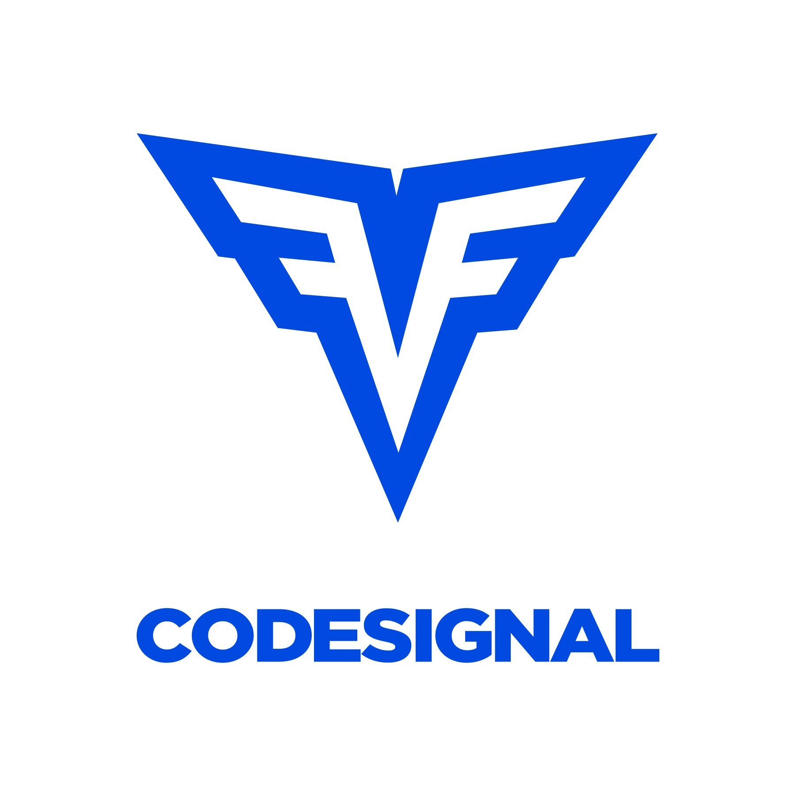

# Code Signal Solutions

<!-- Code Signal Logo -->
 

  

<h3 align="center">Code Signal Solutions and Explanations</h3>

  

    Code Signal is a great place to enhance coding skills and understand the basics of any of the coding languages code signals provides. I am here to help others and myself understand these challenges better. I plan on only going through the python solutions, but might take a stab at the C# or C++ challenges as well. 
   <a href="https://codesignal.com/">Link to Code Signal</a>

<!-- PROJECT SHIELDS -->
[![Contributors][contributors-shield]][contributors-url]
[![Forks][forks-shield]][forks-url]
[![Stargazers][stars-shield]][stars-url]
[![Issues][issues-shield]][issues-url]
<!--[![LinkedIn][linkedin-shield]][linkedin-url]-->
  

<!-- ABOUT THE REPO -->
<h2 align="left">About The Repository</h2>

  This repository contains is in the progress of containing all of the python challenges that Code Signal has on its website as of 3/7/2022. Sorry there isn't much of a description at the moment. Once I start uploading files it will update it.
  This repo is for educational purposes and learning. Not for someone to copy and paste my code in the file

<h3 align="left">Other things needed to take into consideration</h3>

  If there are any errors or anything I missed or should include please raise an issue through github's issues.

  If you would like to contribute to this repo please follow the steps on this <a href="https://www.dataschool.io/how-to-contribute-on-github/">webpage</a>. In the pull request please put the best way to communicate with you, so I can get in touch if I have questions.

<!-- CONTACTS -->
<h2 align="left">Contacts</h2>

<ul>
  <li align="left">Mikayla Kosmala - <a href="https://www.linkedin.com/in/mikayla-kosmala/">LinkedIn</a> + <a href="https://github.com/Mikaykay">Github</a></li>
</ul>

<!-- LICENSE 
<h2 align="left">License</h2>

Distributed under the MIT License. See `LICENSE.txt` for more information.

-->

<!-- ACKNOWLEDGMENTS -->
<h2 align="left">Acknowledgments and Credits</h2>
<ul>
  <li align="left"><a href="https://codesignal.com/">Code Signal</a></li>
  <li align="left"><a href="https://github.com/othneildrew/Best-README-Template">Best-README-Template by othneildrew</a></li>
</ul>

(<a href="#top">back to top</a>)

<!-- MARKDOWN LINKS & IMAGES -->
<!-- https://www.markdownguide.org/basic-syntax/#reference-style-links -->
[contributors-shield]: https://img.shields.io/github/contributors/mikayla-kosmala/code-signal-solutions.svg?style=for-the-badge
[contributors-url]: https://github.com/Airbnb-Build-Week/Project/graphs/contributors
[forks-shield]: https://img.shields.io/github/forks/mikayla-kosmala/code-signal-solutions.svg?style=for-the-badge
[forks-url]: https://github.com/Airbnb-Build-Week/Project/network/members
[stars-shield]: https://img.shields.io/github/stars/mikayla-kosmala/code-signal-solutions.svg?style=for-the-badge
[stars-url]: https://github.com/Airbnb-Build-Week/Project/stargazers
[issues-shield]: https://img.shields.io/github/issues/mikayla-kosmala/code-signal-solutions.svg?style=for-the-badge
[issues-url]: https://github.com/mikayla-kosmala/code-signal-solutions/issues
[product-screenshot]: images/screenshot.png
